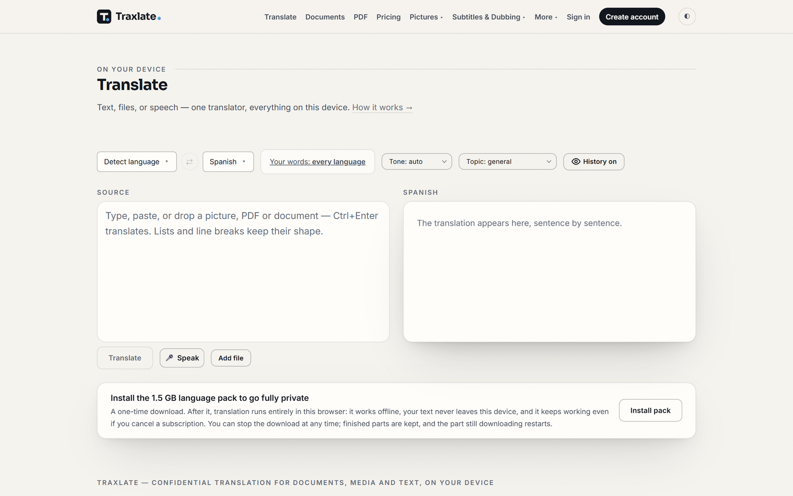
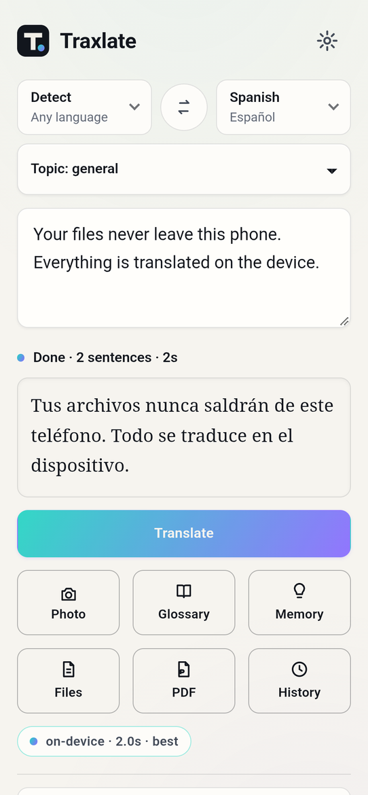
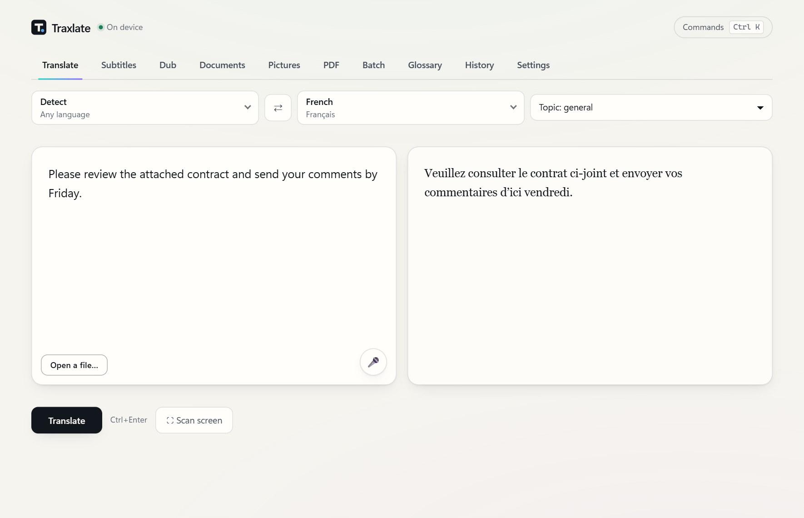
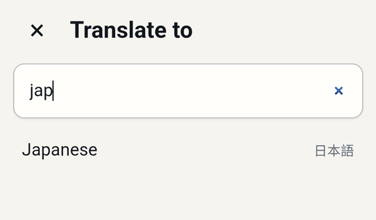
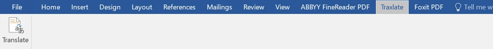
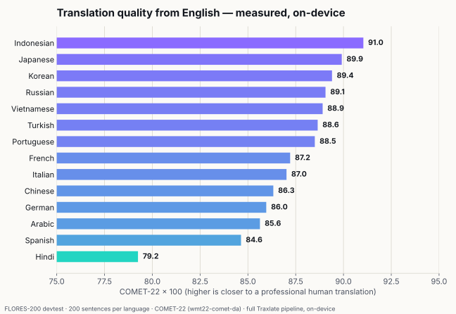
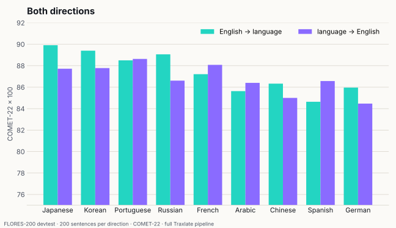
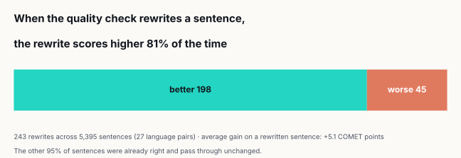

# Traxlate

### Private translation that runs on your own device.

**Traxlate translates text, documents, PDFs, pictures and videos into 66 languages — on your
computer or phone, not on someone else's server.** Nothing you translate is uploaded. After a
one-time download it works offline, and every translation is checked before you see it.

[**Translate now — free →**](https://traxlate.com) &nbsp;·&nbsp;
[Download the apps](https://traxlate.com/apps) &nbsp;·&nbsp;
[Guide](https://traxlate.com/docs) &nbsp;·&nbsp;
[Pricing](https://traxlate.com/pricing) &nbsp;·&nbsp;
[Languages](https://traxlate.com/languages)

 

---

## Why Traxlate

### 🔒 What you translate stays yours
Most translators send your words to a server. Traxlate brings the translator to you instead: the
language pack runs **on your own device**, so a contract, a medical letter or an unreleased
manuscript never leaves it. Privacy isn't a setting — it's how it's built.

### ✈️ Works offline, everywhere you do
Install the language pack once (about 1.5 GB) and translate on a plane, in a basement, or
anywhere without signal. The same engine runs in your browser, on Windows, macOS and Linux, on
Android, and inside Microsoft Word.

### ✅ Every translation is checked
Traxlate reads its own work back before handing it over — catching a dropped sentence, a
changed number or a word that shouldn't be there — and rewrites what fails. When it does rewrite
a sentence, the rewrite scores higher **81% of the time** ([benchmarks](#measured-quality)).

### 📄 Your file comes back as your file
A Word document returns as a Word document, with its headings, tables and formatting. The same
goes for PowerPoint, Excel, EPUB, subtitles and more — not a wall of pasted text.

---

## What it translates

| | |
| --- | --- |
| **Text** | Type, paste or speak. Lists and line breaks keep their shape. |
| **Documents** | Word, PowerPoint, Excel, EPUB, XLIFF, RTF, HTML, Markdown, CSV, plain text — formatting survives. |
| **PDFs** | Page by page, picking up where you left off. Scanned pages are read too. |
| **Pictures** | Photograph a sign, a menu or a page — read and translated on the device. |
| **Subtitles** | Drop in a video and get timed captions in your language. |
| **Dubbing** | A new voice track, timed to the original. The video never leaves your device. |
| **Microsoft Word** | A Traxlate tab in Word: translate a selection or the whole document, in place. |
| **Your words** | A glossary of terms that must be translated your way, and a memory of your corrections. |
| **Human translators** | When it has to be certified, hand it to a professional — quoted before you commit. |

---

## See it

<table>
<tr>
<td width="38%" valign="top">

On a Galaxy Z Fold5 — two sentences into Spanish in 2.0 s, <b>on the phone</b>.

</td>
<td valign="top">

The desktop app — Windows, macOS and Linux.

 

Find any of the 66 languages by typing its English or native name.

</td>
</tr>
</table>

 
The Traxlate tab inside Microsoft Word (Windows).

---

## Measured quality

Quality is measured, not claimed. Every score below is **COMET-22** on the public
**FLORES-200** test set — 200 sentences per language, each compared with a professional human
translation — through the same pipeline the apps ship, running on-device.

**How to read this.** COMET estimates how close a translation is to what a professional would
write — higher is closer. These numbers describe distance to human references; they are **not** a
comparison with other translation services, and no other service was called.
Full method and every number: [BENCHMARKS.md](BENCHMARKS.md).

### Speed

| Device | Measured |
| --- | --- |
| Desktop with an NVIDIA RTX 3070 | **0.36 s** per sentence (median of 195 sentences) |
| Samsung Galaxy Z Fold5 (phone) | **2.0 s** for two sentences, fully on the phone |

---

## Everywhere you work

| Where | Status |
| --- | --- |
| **Web** — any modern browser | ✅ Live at [traxlate.com](https://traxlate.com) — works offline after the pack installs |
| **Windows** | Beta installer ([download](https://traxlate.com/apps)) · includes the Word tab |
| **macOS** (Apple Silicon & Intel) | Beta ([download](https://traxlate.com/apps)) |
| **Linux** (.deb / AppImage) | Beta ([download](https://traxlate.com/apps)) |
| **Android** | Beta APK ([download](https://traxlate.com/apps)) · Google Play coming |
| **iOS** | Coming |
| **Developers & AI agents** | A local API on your own machine, a command line, and tools your AI agent can call — [developers guide](https://traxlate.com/developers) |

---

## 66 languages

Afrikaans · Amharic · Arabic · Armenian · Azerbaijani · Basque · Bengali · Bulgarian · Burmese · Catalan · Chinese (Simplified) · Chinese (Traditional) · Croatian · Czech · Danish · Dutch · English · Finnish · French · Galician · Georgian · German · Greek · Gujarati · Hausa · Hebrew · Hindi · Hungarian · Indonesian · Italian · Japanese · Kannada · Kazakh · Khmer · Korean · Lao · Malay · Malayalam · Marathi · Mongolian · Nepali · Norwegian · Persian · Polish · Portuguese · Punjabi · Romanian · Russian · Serbian · Sinhala · Slovak · Somali · Spanish · Swahili · Swedish · Tagalog · Tamil · Telugu · Thai · Turkish · Ukrainian · Urdu · Uzbek · Vietnamese · Yoruba · Zulu

[Every language, with what each one supports →](https://traxlate.com/languages)

---

## Pricing

**Free to start** — no card, and no account for your first pages. The free plan covers 30 pages a month;
the paid plans remove the page limit and add more devices.
See [traxlate.com/pricing](https://traxlate.com/pricing) for current plans.

---

## Support

- **Guide:** [traxlate.com/docs](https://traxlate.com/docs)
- **Help:** [traxlate.com/support](https://traxlate.com/support)
- **Privacy:** [traxlate.com/privacy](https://traxlate.com/privacy) · **Security:** [traxlate.com/security](https://traxlate.com/security)

 
Traxlate is made by <b>Arad Soft</b>. This repository is the project's public page; the application itself is proprietary. 
© 2026 Arad Soft. All rights reserved.

